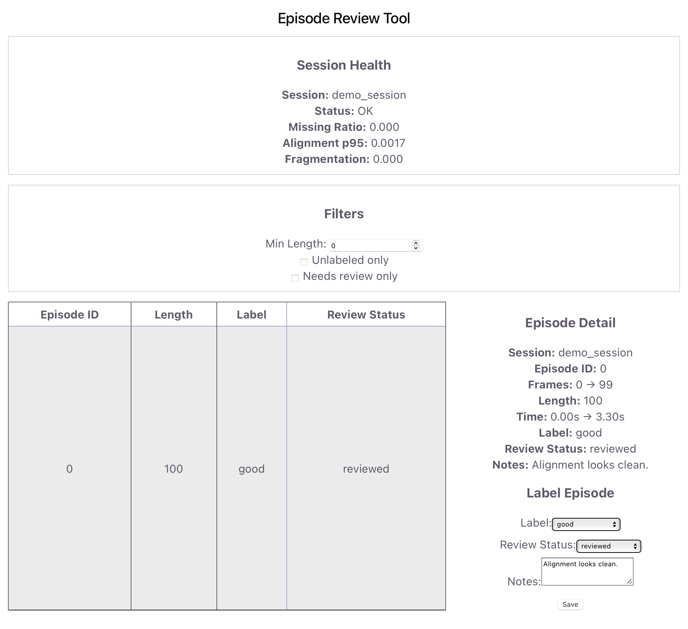
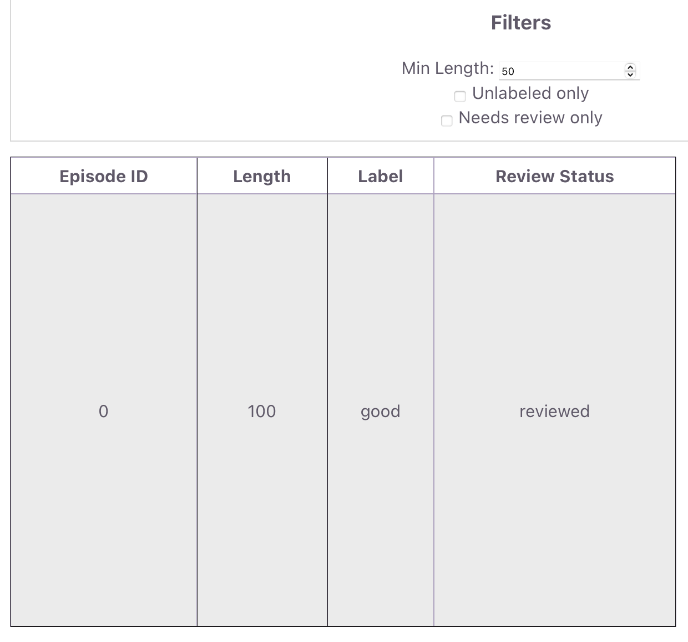
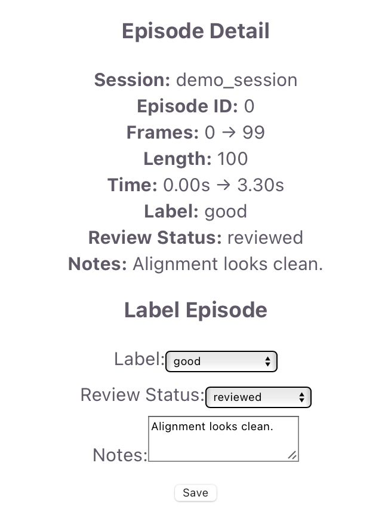

# Multimodal Dataset Review & Labeling Tool


A full-stack data tool simulating the human-in-the-loop dataset curation layer used in robotics and ML evaluation systems.

This project builds a lightweight interface on top of structured validation-aware dataset artifacts to support episode-level inspection, filtering, and persistent annotation of multimodal trajectory data.

---

## TL;DR

This system enables inspection, filtering, and annotation of robotics dataset artifacts.

```text
Dataset artifacts
(episodes + health metrics)
↓
FastAPI backend
(inspection API)
↓
React UI
(table + detail + filters)
↓
Human-in-the-loop review
(labels + notes)
↓
episode_labels.json
(persistent annotation layer)
```

This tool models how human reviewers interact with structured datasets during curation and evaluation workflows.

---

## Demo

Full dataset review interface:



---

## Overview

This project demonstrates how structured dataset artifacts can be exposed to a human reviewer for:

- inspection
- filtering
- labeling
- iterative dataset curation

The system is intentionally minimal, focusing on:

- API design
- frontend interaction patterns
- human-in-the-loop data workflows

---

## Why This Project Exists

Raw datasets are not sufficient for training or evaluation.

In practice, teams must:

- identify bad data (alignment issues, missing data)
- prioritize which samples to review
- annotate or filter problematic segments
- iteratively refine datasets

This project models that process by providing a simple review interface on top of structured dataset artifacts.

---

## What This Project Is / Is Not

### Is

- A dataset inspection and labeling interface
- A human-in-the-loop curation layer
- A minimal full-stack data tool (React + FastAPI)
- A simulation of labeling workflows in ML/data platforms

### Is Not

- A full annotation platform (no bounding boxes or frame-level labeling)
- A distributed system
- A production deployment
- A training pipeline

The focus is **episode-level inspection and labeling**.

---

## System Architecture

```text
Dataset Layer
  episodes.json
  episode_health.json
  alignment_health.json
        │
        ▼

Backend (FastAPI)
  • GET /episodes
  • GET /session-health
  • GET /labels
  • POST /labels
        │
        ▼

Frontend (React + TypeScript)
  • Episode table
  • Detail panel
  • Filters
  • Label form
        │
        ▼

Annotation Layer
  • episode_labels.json
```

---

## Core Features

### Episode Inspection

- Displays trajectory episodes in a table
- Shows length, label, and review status
- Allows selection of individual episodes

### Detail View

- Shows episode metadata:
  - frame range
  - timestamps
  - label / review status
  - notes

### Session Health Metrics

- Missing data ratio
- Alignment error (p95)
- Fragmentation score
- Overall dataset status

### Filtering

- Minimum episode length
- Unlabeled-only filter
- Needs-review filter

Filters are applied via backend query parameters.

Example filtered episode view:



### Labeling

Users can assign:

- label (`good`, `bad_alignment`, `missing_data`)
- review status (`needs_review`, `reviewed`)
- free-form notes

Example labeling interaction:



---

## Data Flow

### Read Path

```text
Frontend
↓ GET /episodes
FastAPI
↓ reads dataset artifacts
Merged response
↓
Frontend renders table
```

### Write Path

```text
User edits label
↓
POST /labels
↓
FastAPI updates episode_labels.json
↓
Frontend reloads episodes
↓
UI updates
```

---

## Example Annotation Output

```json
[
  {
    "session_id": "demo_session",
    "episode_id": 0,
    "label": "good",
    "review_status": "reviewed",
    "notes": "UI save test"
  }
]
```

This file represents the persistent annotation layer.

---

## Tech Stack

### Backend

- Python
- FastAPI
- JSON-based storage

### Frontend

- React
- TypeScript
- Vite

---

## Relationship to Data Engine

This project is designed to sit on top of the Multimodal Robotics Data Engine.

```text
robotics_data_engine
  → constructs datasets

THIS PROJECT
  → inspects and curates datasets
```

Together, they model:

```text
raw data
↓
dataset artifacts
↓
human review
↓
curated dataset
```

---

## Future Extensions

- Multi-session dataset browser
- Dataset quality dashboards
- Database-backed label storage
- Authentication / multi-user support
- Frame-level annotation UI
- Integration with training pipelines

---

## Project Scope

This project focuses on the interaction layer between:

- structured datasets
- human reviewers

It does not include:

- large-scale distributed processing
- production deployment
- model training

---

## Usage Notice

This repository is shared for portfolio, educational, and demonstration purposes.

Please contact the author for permission before reusing or redistributing the code.

---

## Author

Philippe Do
